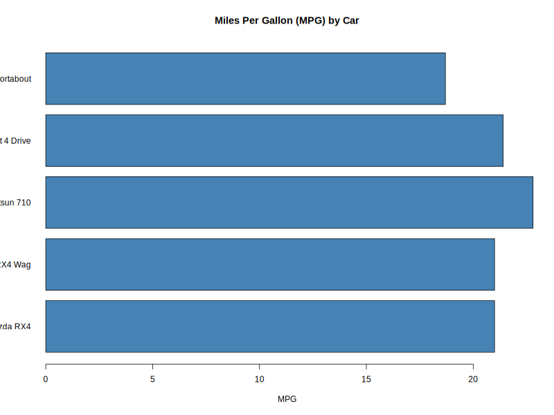
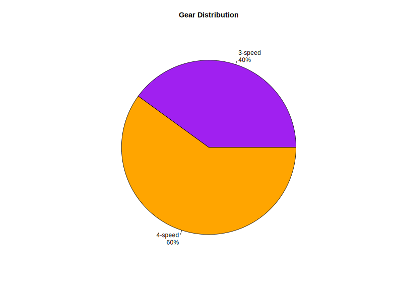
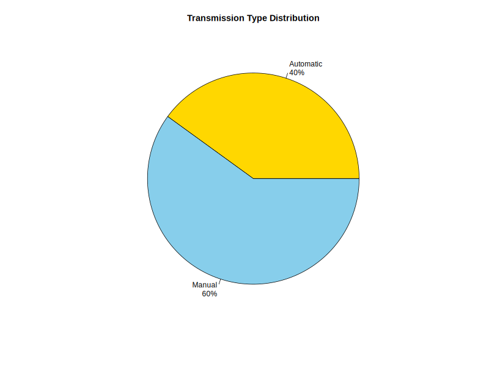

# 📉 Tutorial 15: Basic Data Visualization in R 🎨

Welcome to the **Data Visualization** module! This repository documents how I transform raw financial and technical data into high-impact visual intelligence. Whether analyzing corporate debt at **Zamtel** or vehicle specs in the `mtcars` dataset, clarity is the priority. 🇿🇲

---

## 🎯 The Vision: Visualizing Risk & Performance
Data visualization is the bridge between complex calculations and executive decision-making. By mapping data points, I can instantly identify:
* **Exposure Hotspots:** Which corporate clients hold the highest risk? 🚩
* **Performance Trends:** Comparing efficiency metrics across different models or accounts. 📈
* **Proportional Analysis:** Understanding how a total portfolio is divided. 🍕

---

## 🛠️ The Visualization Stack
I utilize two primary approaches to graphics in R:

1.  **Base R Graphics:** Efficient, built-in tools for immediate data inspection.
2.  **`ggplot2`:** The professional industry standard based on the *Grammar of Graphics*, allowing for layered, publication-ready charts.

---

## 📊 Data Visualization Gallery

Below are the visual outputs generated during this module. These charts demonstrate my ability to handle different data structures and visualization styles.

### 1. Performance & Fuel Efficiency
Using a bar graph to compare specific numerical values (MPG) across different categories. This is the same logic used to compare **Corporate Account Balances**.


### 2. Proportional Distribution (Gears)
A pie chart used to visualize how a fleet is divided by gear count. In a banking context, this represents the split between different **Credit Statuses**.


### 3. System Overview (Transmission)
This visual highlights the binary split between Automatic and Manual systems, demonstrating how R can simplify complex datasets into clear proportions.


---

## 💻 Technical Milestones

### Categorical Comparisons 📊
I use Bar Charts to rank entities. This is essential for identifying which clients require the most urgent engagement based on their outstanding balance.
```r
# Creating a bar graph for Horsepower
barplot(mtcars$hp[1:5], names.arg = rownames(mtcars)[1:5], col = "steelblue")
